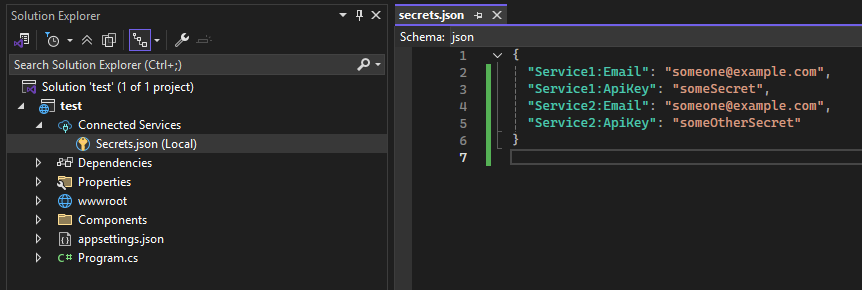
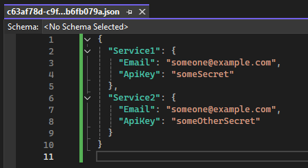
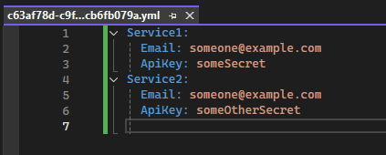
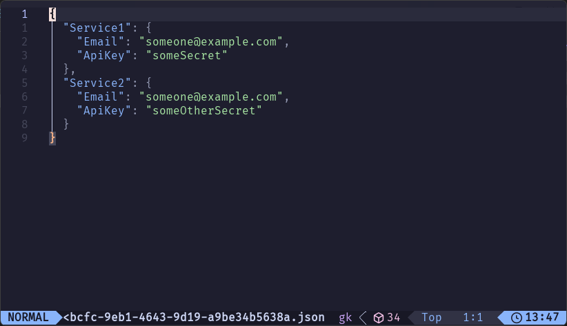

# dotnet-manage-secrets 

Manage your .NET user secrets using your format and editor of choice! 

[](#)
[](#)
[](#)
[](#)
[](#)
[](#)
[](#)
[](#)
[](#)
[](#)

## Installation

Install as a .NET tool: 
```sh
dotnet tool install -g DotnetManageSecrets
```

## About

[User Secrets](https://learn.microsoft.com/en-us/aspnet/core/security/app-secrets) are a great tool to manage sensitive configuration options while minimising the risk of accidentally committing them to version control, but the `dotnet user-secrets` command can be unintuitive and slow to use. 

This tool is inspired by the Visual Studio secrets editor, which allows you to edit the underlying secrets file (`~/.microsoft/usersecrets/<GUID>/secrets.json`) directly, but only using its native "flattened json" format, and only for project types supported by the Connected Services feature. 



This tool makes the experience far more intuitive by presenting the data in more sensible formats, such as nested JSON or YAML. 

<p float="left">
  
  
</p>

Additionally, it extends compatibility to all major editors - just set `$EDITOR` or pass `--editor|-e`. Here it is working with Neovim: 


<sup>Legend has it that this author was stuck in vim forever more...</sup>

## License 

This tool is published under the [MIT License](./LICENSE.md). 

## Credits

Badges from [inttter/md-badges](https://github.com/inttter/md-badges)